# Campus Connect   
##### (Screenshots attached below)

## Description
**Campus Connect** is an Android app developed to bridge the gap between the students and the facultys/the admins. 

### Features for students -
- Students can see their attendance subject wise.
- Students can check their class routine day wise as well as week wise.
- Students can access all study materials at one place.
- Students can get all notifications and news from their departments as well as college admins at one place.

### Features for facultys -
- Facultys can manage attendance of students on the app itself.
- Facultys can share notifications of study materials on one go to the students.

## Android Architecture Components
- Firebase Auth
- Firestore
- MVVM Architecture
- LiveData
- ViewModel
- Retrofit

## About App

**Campus Connect** is an Android app for a College Administration, Faculty and Students

- It divided 2 Sections

### 1.Students
  
**Students Section** divided into mainly 3 Sections  - Data is displayed according to thier selected Branch and Semester.

- **1. Schedule** - Student gets thier Attendance (maintained by faculty in live-time) and Schedule according to Day of the Week
- **2. Subjects** - Student gets thier Subject list as per given in Semester. Every Subject Section consists its study materials.
- **3. Notifications** - Student gets Latest Notifications sent by the Admisnistration
  
  
||||
|:----------------------------------------:|:-----------------------------------------:|:-----------------------------------------: |
| 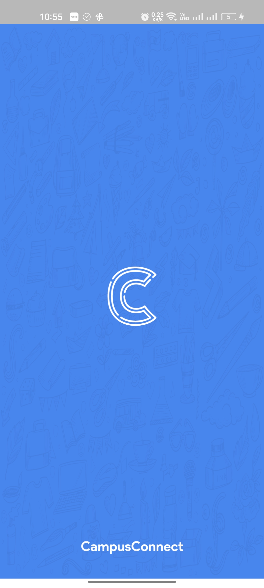 | 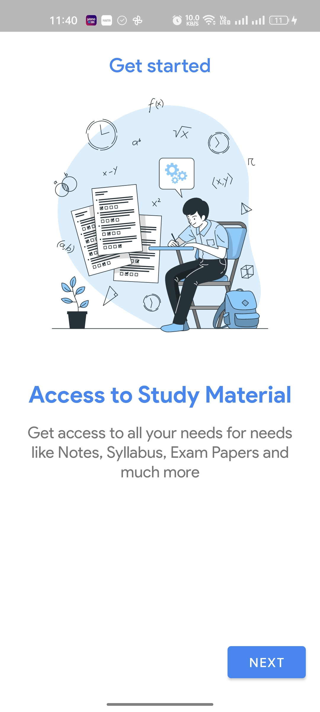 | 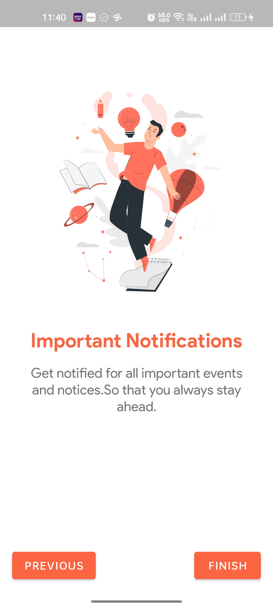 | 
| 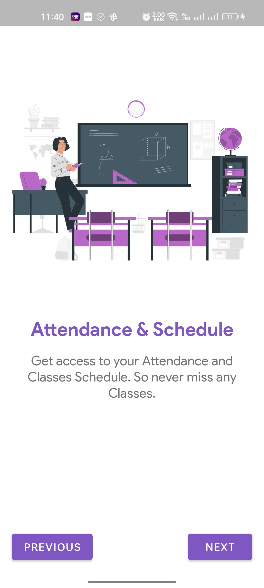 | 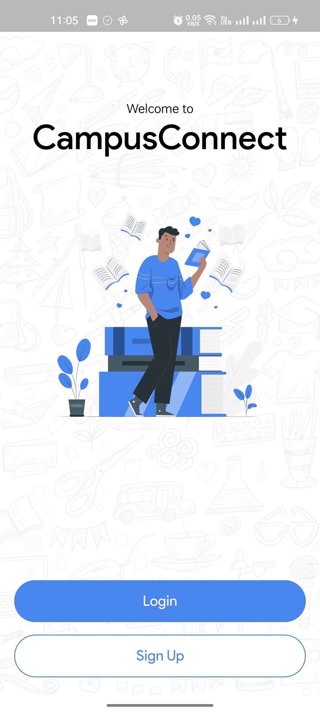 | 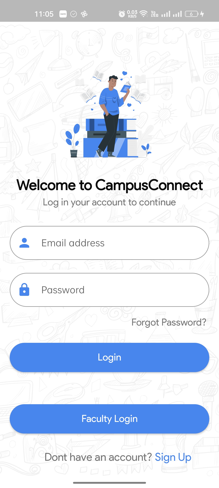 |
| 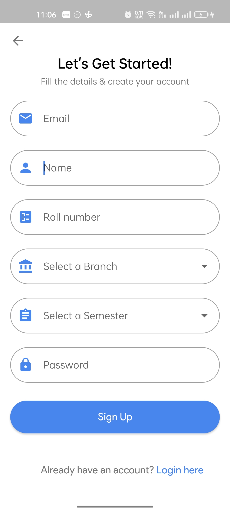 | 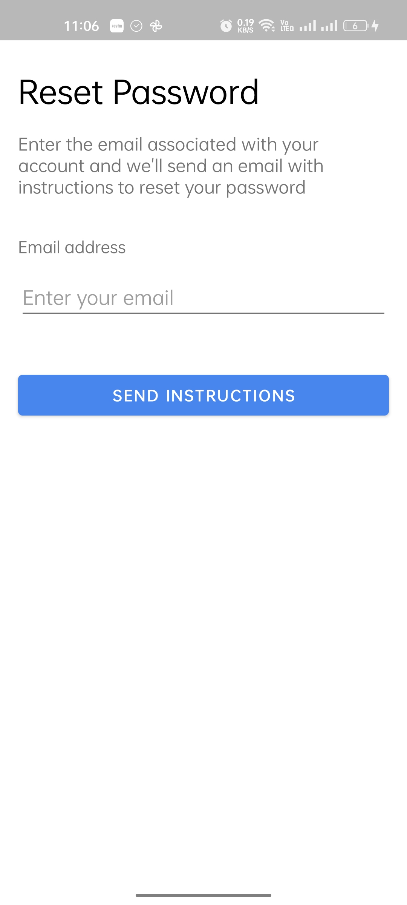 | 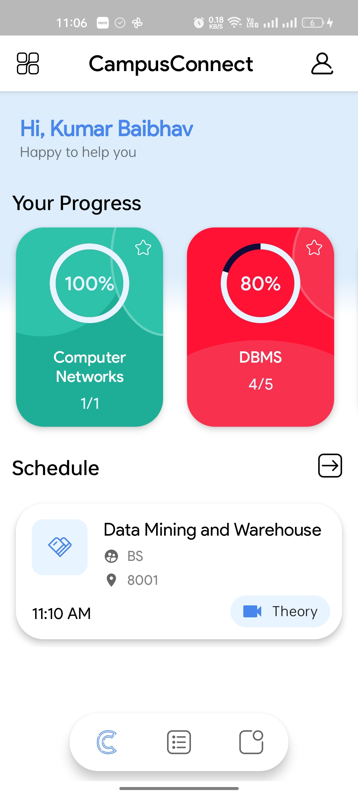 |
| 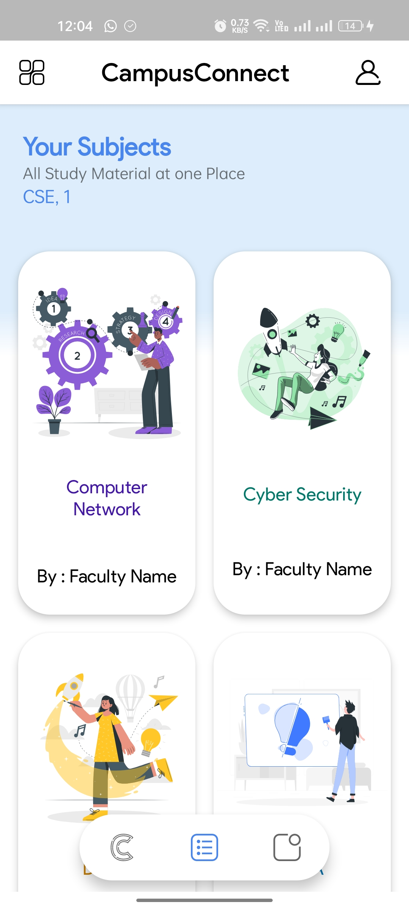 | 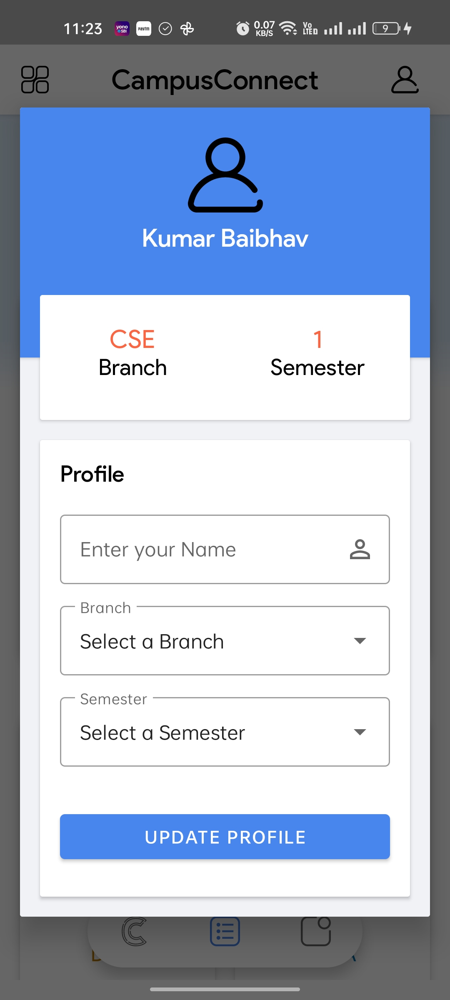 | 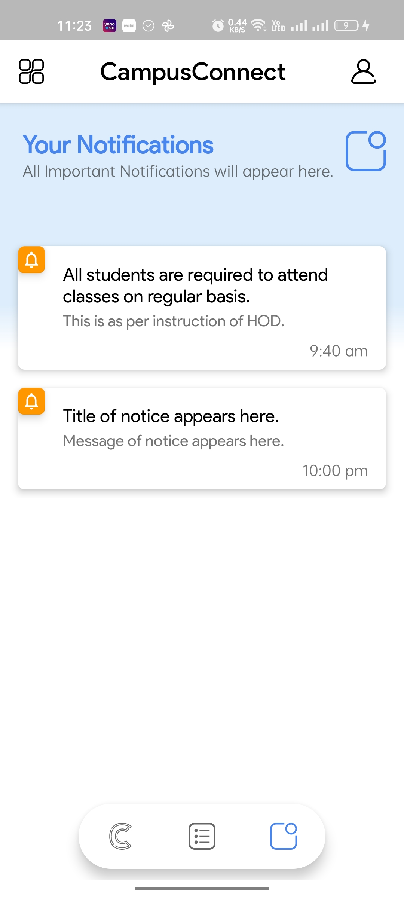 |
| 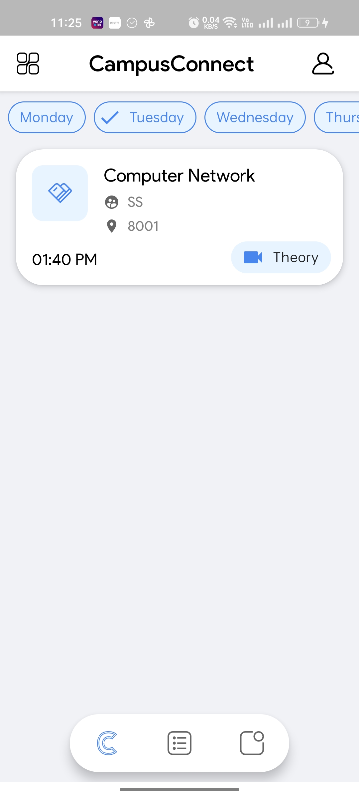 | 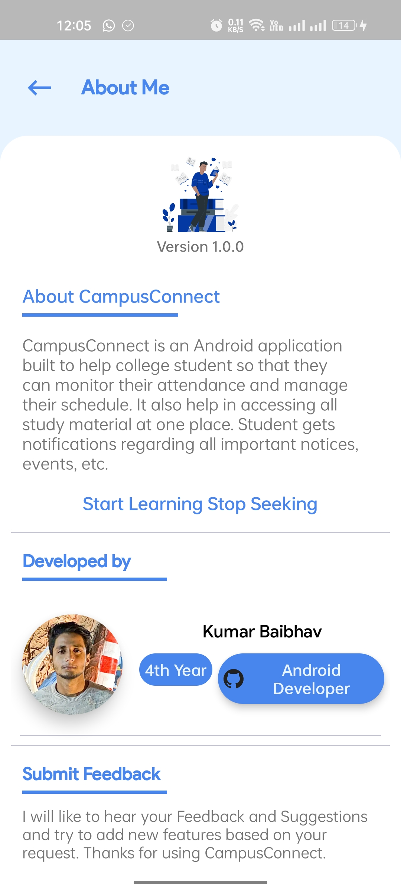 | 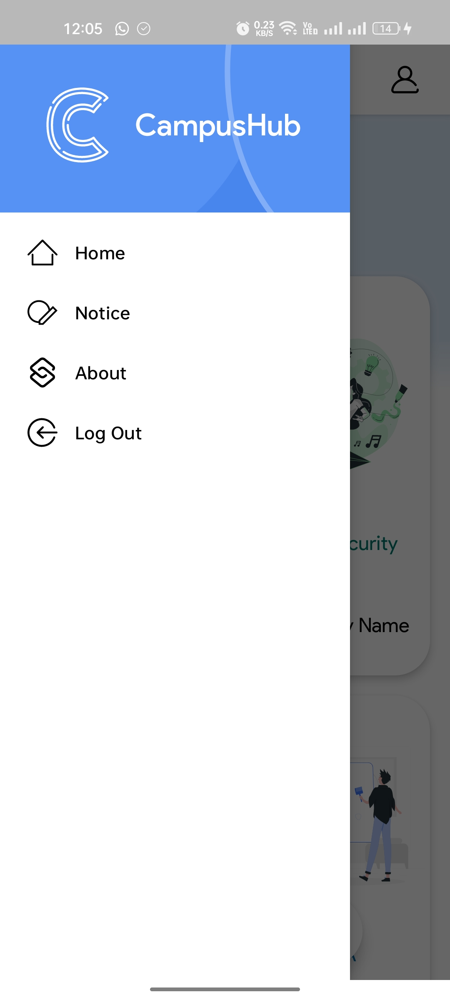 |

  
  
    
### 2.Faculty

Faculty can manange students attendance and study materials according to the Subject.

||||
|:----------------------------------------:|:-----------------------------------------:|:-----------------------------------------: |
| 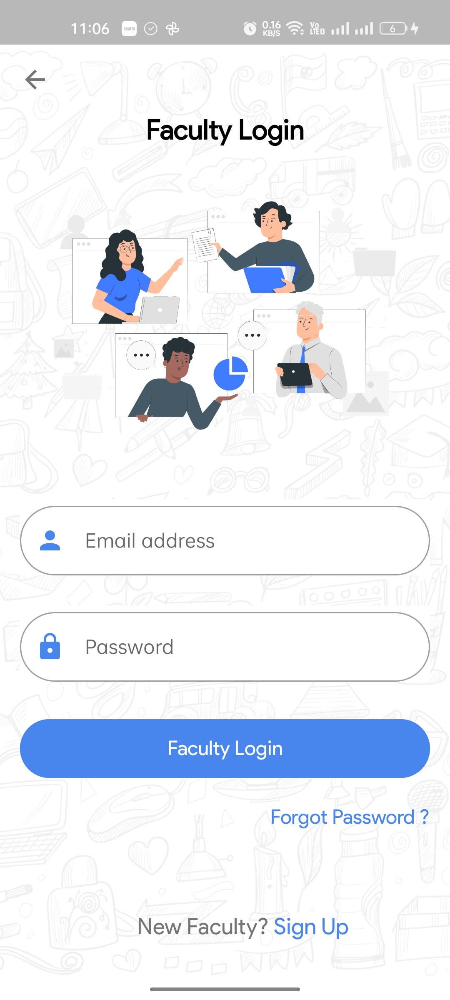 | 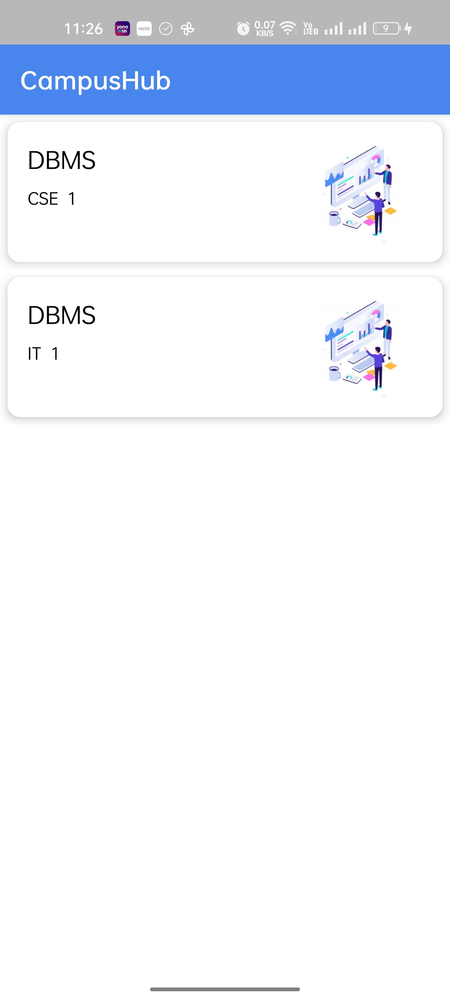 | 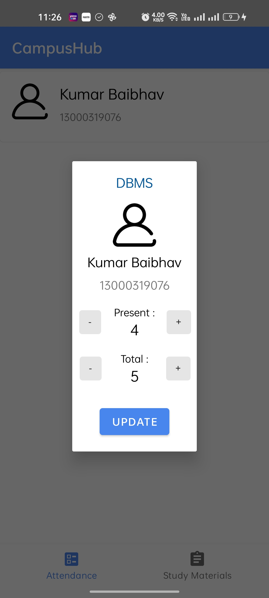 |
|  | 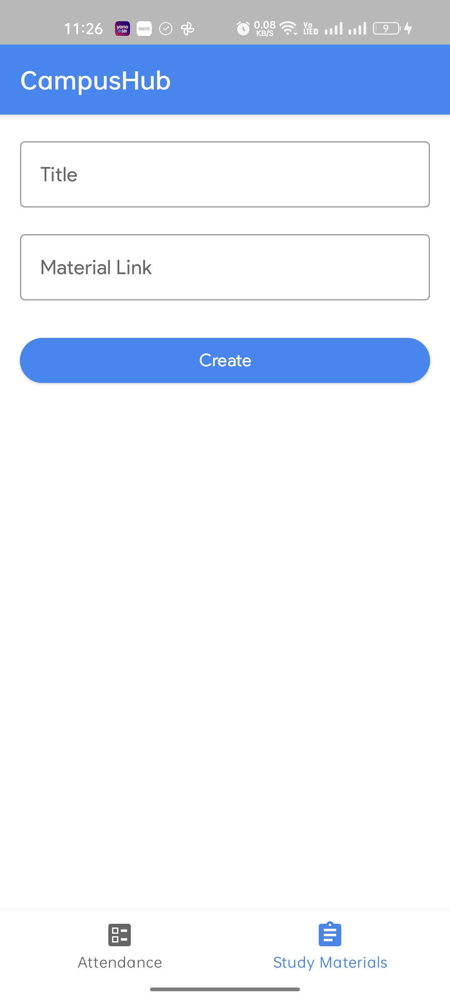 |

## Architecture
This app uses [***MVVM (Model View View-Model)***](https://developer.android.com/jetpack/docs/guide#recommended-app-arch) architecture.

 

 ## Contact
If you need any help, you can connect with me.

Email - baibhavrajputt@gmail.com
